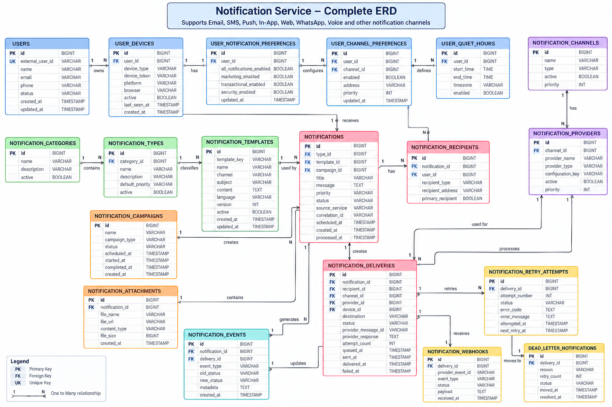

# 🔔 Notification Service Design

A scalable **Multi-Channel Notification Service** for sending, tracking, retrying, and managing notifications through Email, SMS, Push, In-App, WhatsApp, and other channels.

## 👨‍💻 Candidate

**RIDA FARHIN**

**Role:** Software Engineer / Java Full Stack Developer

## 🎯 Objectives

- Support multiple notification channels
- Support multiple recipients
- Track delivery status
- Handle retries and failures
- Support provider fallback
- Manage notification templates
- Support user preferences
- Support scheduled notifications
- Maintain notification events and history

## 🏗️ Architecture

```text
Client Services
      ↓
Notification API
      ↓
Notification Service
      ↓
Message Queue
      ↓
Notification Workers
      ↓
Channels / Providers
      ↓
External Services
```

## 🗺️ ERD

<p align="center">
  
</p>

## 🗄️ Main Database Entities

```text
USERS
USER_DEVICES
USER_NOTIFICATION_PREFERENCES
USER_CHANNEL_PREFERENCES
USER_QUIET_HOURS

NOTIFICATION_CATEGORIES
NOTIFICATION_TYPES
NOTIFICATION_TEMPLATES
NOTIFICATIONS
NOTIFICATION_RECIPIENTS

NOTIFICATION_CHANNELS
NOTIFICATION_PROVIDERS
NOTIFICATION_DELIVERIES
NOTIFICATION_RETRY_ATTEMPTS
NOTIFICATION_WEBHOOKS
NOTIFICATION_EVENTS

NOTIFICATION_ATTACHMENTS
NOTIFICATION_CAMPAIGNS
DEAD_LETTER_NOTIFICATIONS
```

## 🔄 Core Flow

```text
User
 ↓
Notification Recipient
 ↓
Notification
 ↓
Delivery
 ↓
Channel
 ↓
Provider
 ↓
External Service
 ↓
Delivery Status
```

## 🔁 Retry & Fallback

```text
Delivery
   ↓
Failed
   ↓
Retry
   ↓
Provider Fallback
   ↓
Success
```

If all attempts fail:

```text
Failed
   ↓
Dead Letter
```

## ⭐ Key Design Decisions

- `NOTIFICATION_RECIPIENTS` allows one notification to have multiple users.
- `NOTIFICATION_DELIVERIES` tracks each channel delivery independently.
- `NOTIFICATION_CHANNELS` separates communication channels from providers.
- Multiple providers allow fallback when a provider fails.
- `NOTIFICATION_RETRY_ATTEMPTS` maintains retry history.
- Webhooks update delivery status asynchronously.
- Message queues allow scalable asynchronous processing.

## 🛠️ Suggested Technology Stack

```text
Backend     → Java + Spring Boot
Database    → PostgreSQL / MySQL
Messaging   → Kafka / RabbitMQ
Cache       → Redis
Security    → Spring Security + JWT
Deployment  → Docker / Kubernetes
Storage     → AWS S3
```

## 🎤 Interview Summary

The Notification Service is designed as a centralized and scalable system for managing multi-channel notifications. The core design separates notifications, recipients, deliveries, channels, and providers, allowing the system to support multiple users, multiple channels, retries, provider fallback, scheduling, delivery tracking, and asynchronous processing.

## 📁 Repository Structure

```text
notification-service-design-rida/
│
├── README.md
├── Notification_Service_ERD.md
└── Notification_Service_Complete_ERD.png
```


## 👨‍💻 Prepared By

**RIDA FARHIN**

**Software Engineer / Java Full Stack Developer**

**Notification Service System – Database & System Design**

---

## ⭐ Project Status

**Status:** Completed

**Type:** Database Design + System Design

**Focus:** Scalable Multi-Channel Notification Service
